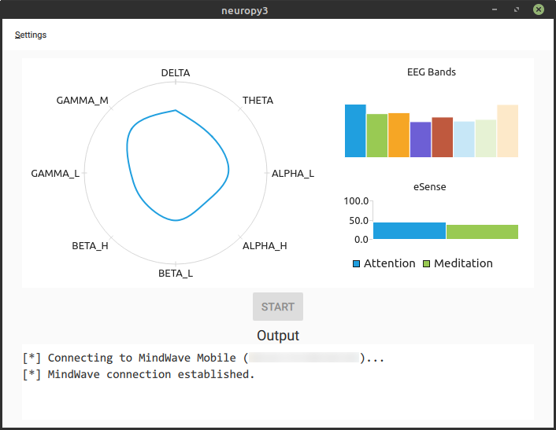
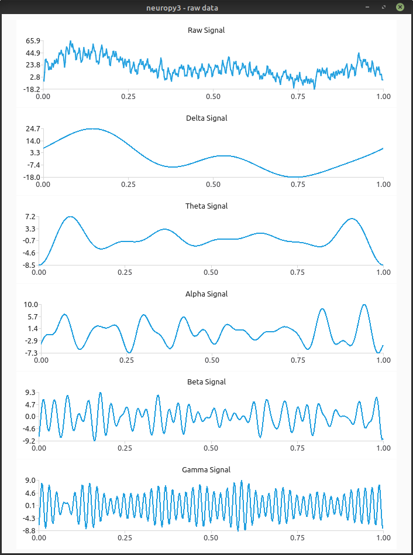

# Description
Python3 library to read data from Neurosky Mindwave Mobile 2 on linux using
pybluez2.

**Contents:**
  - [Requirements](#requirements)
  - [Pre-execution](#pre-execution)
  - [Execution](#execution)
    - [Command line interface](#command-line-interface)
    - [Graphical user interface](#graphical-user-interface)
    - [Importing library](#importing-library)
  - [Acknowledgements](#acknowledgements)
  - [License](#license)

# Requirements
- libbluetooth-dev

# Pre-execution
You can install dependencies via setup.py
```bash
$ python -m pip install .
$ python -m pip install .[gui] # to install gui dependencies
```
via python package index (PyPI)
```bash
$ python -m pip install neuropy3
$ python -m pip install neuropy3[gui] # to install gui dependencies
```
or manually
```bash
$ python -m pip install -r requirements.txt
$ python -m pip install -r gui_requirements.txt # to install gui dependencies
```

# Execution
## Command line interface
```bash
$ python -m neuropy3
$ python -m neuropy3 --address XX:YY:ZZ:AA:BB:CC
$ python -m neuropy3 --help
```
> Address argument helps speed up connection process, otherwise a neuropy3
> will run a scan of nearby bluetooth devices (which takes a lot).

## Graphical user interface
```bash
$ python -m neuropy3 --gui
$ python -m neuropy3 --address XX:YY:ZZ:AA:BB:CC --gui
```
> Note: requires neuropy3[gui] extra dependencies
<details>
    <summary>Screenshots</summary>
    <div align="center">
        
    </div>
    <div align="center">
        
    </div>
</details>

## Importing library
```python
>>> from neuropy3.neuropy3 import MindWave
>>> mw = MindWave(address='XX:YY:ZZ:AA:BB:CC', autostart=False, verbose=3)
>>> # mw = MindWave(autostart=False, verbose=3)  # Autoscan for MindWave Mobile
>>> mw.set_callback('eeg', lambda x: print(x))
>>> mw.set_callback('meditation', lambda x: print(x))
>>> mw.set_callback('attention', lambda x: print(x))
>>> mw.start()
>>> mw.unset_callback('eeg')
>>> mw.stop()
```

# Acknowledgements
**This work has been supported by National R&D Project TEC2017-84197-C4-1-R and by the
Comunidad de Madrid project CYNAMON P2018/TCS-4566 and co-financed by European Structural
Funds (ESF and FEDER)**

- Based on [lihas/NeuroPy](https://github.com/lihas/NeuroPy) library.
- Communication protocol from [neurosky](http://developer.neurosky.com/docs/doku.php?id=thinkgear_communications_protocol).

# License
    neuropy3  Copyright (C) 2022-2023 Sergio Chica Manjarrez @ pervasive.it.uc3m.es.
    Universidad Carlos III de Madrid.
    This program comes with ABSOLUTELY NO WARRANTY; for details check below.
    This is free software, and you are welcome to redistribute it
    under certain conditions; check below for details.

[LICENSE](LICENSE)
